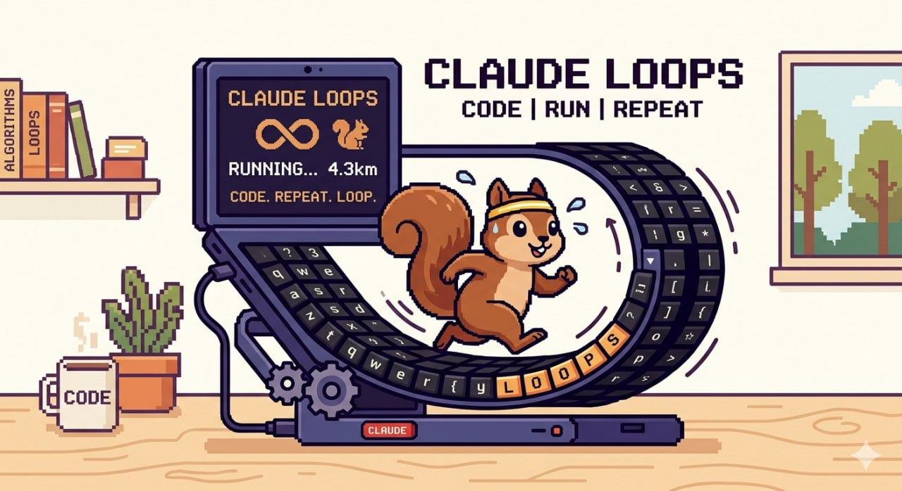

# claude-loops

<p align="center">
  
</p>


Claude Code용 루프 엔지니어링 스킬 모음.

`/dev-plan → /dev-loop → /dev-verify` 파이프라인으로 목표를 입력하면 자동으로 완료까지 실행합니다.

---

## 루프 파이프라인 스킬

코드 작성 → 검증 → 반복 루프를 자동화하는 핵심 스킬들.

| 스킬 | 트리거 | 역할 |
|------|--------|------|
| `dev-plan` | `/dev-plan` | 요구사항 인터뷰 + SPEC.md 생성 |
| `dev-loop` | `/dev-loop` | SPEC 기반 구현 → 검증 루프 |
| `dev-loopcode` | `/dev-loopcode` | 코드 타입 탐지 → 병렬 빌드 → 4단계 검증 + ADR + 리팩토링 제안 |
| `dev-verify` | `/dev-verify` | 최종 품질 심사 |
| `dev` | `/dev` | plan→loop→verify 전체 파이프라인 |
| `dev-hwaloop` | `/dev-hwaloop` | 2-에이전트 토론 설계 + 루프 |

---

## 유틸리티 스킬

루프 파이프라인과 독립적으로 동작하는 보조 도구. 개발 중 막혔을 때 참조용으로 활용한다.

| 스킬 | 트리거 | 역할 |
|------|--------|------|
| `graphify` | `/graphify` | 코드·문서 폴더 → 지식 그래프 생성 (HTML + JSON) |
| `m-search` | `/m-search` | 과거 Claude 대화 DB 키워드 검색 |

### graphify

**어떻게 들어왔는가**  
`dev-loopcode`의 PLAN-DEBATE 단계에서 "이 코드가 어디에 영향 주는가"를 빠르게 파악하기 위해 포함됐다.  
대규모 프로젝트에서 VERIFY-2의 도메인 언어 검사를 할 때 코드베이스 전체 구조가 필요한 경우에도 쓰인다.

**기능**  
- 지정 폴더의 코드/문서/논문/이미지를 분석해 지식 그래프 생성
- 출력: `graphify-out/graph.json`, `graph.html` (인터랙티브), `GRAPH_REPORT.md`
- 커뮤니티 탐지 — 연관 파일 그룹 자동 분류
- `--update` 플래그로 변경된 파일만 증분 갱신

**사용 사례**

```bash
# 위키 폴더 전체를 그래프로 빌드
/graphify H:\내 드라이브\RoomDeskTop\llm-wiki\raw\

# 특정 질문에 대한 관련 문서 탐색 (BFS)
/graphify query "Selenium 세션 크래시 해결법"

# 변경 파일만 갱신
/graphify H:\내 드라이브\RoomDeskTop\llm-wiki\raw\ --update
```

> **실제 활용**: 위키(`llm-wiki`)에 `/graphify`를 실행해두면, 이후 질문 시 `graph.json`을 BFS/DFS 탐색해 관련 문서를 빠르게 찾는다. Claude Code가 매번 raw 파일을 전수 읽는 대신 그래프 인덱스로 먼저 범위를 좁히는 방식이다.

---

### m-search

**어떻게 들어왔는가**  
루프 중 막혔을 때 "이전 세션에서 같은 문제를 어떻게 풀었지?"를 찾기 위해 포함됐다.  
Claude Code 대화는 세션마다 컨텍스트가 초기화되므로, 과거 해결 패턴을 재활용할 수 있는 검색 도구가 필요하다.

**기능**  
- `conv_archive.py`가 로컬 `.jsonl` 대화 로그를 SQLite DB(`conv_archive.db`)로 인덱싱
- 키워드로 대화 내용 전문 검색
- 검색 결과를 텔레그램으로 수신 (세션 ID, 날짜, 발췌문)
- `/m-session <id>`로 특정 세션 전체 내용 조회

**사용 사례**

```
/m-search selenium 드라이버
→ 과거에 Selenium 관련 문제를 다뤘던 세션 목록 + 발췌문 수신

/m-search RESCUE 전략
→ RESCUE 모드가 실제 적용된 과거 세션 참조

/m-session abc123
→ 특정 세션 전체 대화 조회
```

> **전제 조건**: `conv_archive.py`와 `conv_archive.db`가 `$CLAUDE_HOME`에 있어야 한다.  
> DB가 없으면 `/m-search --scan`으로 기존 `.jsonl` 파일을 일괄 import한다.  
> **텔레그램 연동 필수** — m-search는 결과를 텔레그램으로만 전송한다.

---

## 설치

### Windows (PowerShell)
```powershell
git clone https://github.com/nokelan/claude-loops.git
cd claude-loops
.\install.ps1
```

### macOS / Linux
```bash
git clone https://github.com/nokelan/claude-loops.git
cd claude-loops
bash install.sh
```

기본 설치 경로: `~/.claude/skills/`  
다른 경로 사용 시:
```powershell
.\install.ps1 -ClaudeHome "C:\Users\YourName\.claude"
```

### 업데이트

```powershell
# Windows
.\update.ps1

# macOS / Linux
bash update.sh
```

---

## 환경 설정

텔레그램 알림이나 m-search 기능 사용 시 `.env` 설정 필요:

```bash
cp .env.example .env
# 이후 .env에서 TELEGRAM_CHAT_ID 등 설정
```

> `graphify`와 루프 파이프라인 스킬은 텔레그램 없이도 동작한다.  
> `m-search`는 텔레그램 연동이 필수다.

---

## SPEC 템플릿

`templates/` 폴더에 프로젝트 타입별 SPEC.md 예시가 있습니다:

| 폴더 | 용도 |
|------|------|
| `templates/web/` | React / Next.js / Vanilla 웹 프로젝트 |
| `templates/desktop/` | WinForms / WPF / C# 데스크탑 앱 |
| `templates/server/` | REST API / FastAPI / ASP.NET 서버 |
| `templates/docs/` | HTML 보고서 / 문서 자동 생성 스크립트 |

`/dev-plan` 없이 바로 시작할 때 해당 템플릿을 SPEC.md로 복사 후 수정하세요.

---

## 파이프라인 흐름

```
/dev "할일 앱 만들어줘"
    ↓
[dev-plan]  요구사항 인터뷰 → SPEC.md
    ↓
[dev-loop]  구현 → 검증 루프 (최대 5회)
    ↓
[dev-verify] 최종 품질 심사
    ↓
완료 보고
```

코드/API/앱 타입에 특화된 검증이 필요하면 `/dev-loopcode` 사용:

```
/dev-loopcode "목표"
    ↓
[INIT]        타입 탐지 (code|api|app) + CONTEXT.md 도메인 언어 로드
    ↓
[GOAL INTERVIEW] 목표 모호 시 AC 확정까지 반복 질문
    ↓
[PLAN-DEBATE] Agent-A(설계자) vs Agent-B(비평가) 토론 → 사용자 확정
    ↓
[HARD GATE]   AC 측정가능성 검사
    ↓
[BUILD]       병렬 IMPLEMENTER 에이전트 (depends_on 그래프)
    ↓
[VERIFY-1]    빌드 · 문법 검증
    ↓
[VERIFY-2]    AC 기능 검증 + grill-with-docs 도메인 언어 검사
    ↓
[VERIFY-3]    Adversarial 검증 (Claude or Codex)
    ↓
[RESCUE]      max-loops 임박 시 탈출 전략 주입 (자동)
    ↓
[완료]        ADR.md 갱신 + 리팩토링 TOP3 제안
```

---

## Examples

`examples/` 폴더에 실제 검증된 사용 예제가 있습니다.

### wordcount-cli — Python CLI 단어통계 도구

`/dev-loopcode` 전체 파이프라인 테스트용 예제 (PLAN→BUILD→VERIFY-1~3→ADR).

```bash
cd examples/wordcount-cli
python wordcount.py sample.txt
# 줄 수: 10
# 단어 수: 98
# TOP5 단어:
#   1. the        (18)
#   2. fox        (9)
#   ...

pytest test_wordcount.py  # 5/5 PASS
```

포함 파일: `wordcount.py`, `test_wordcount.py`, `sample.txt`, `SPEC.md`, `ADR.md`

---

## 라이선스

MIT
